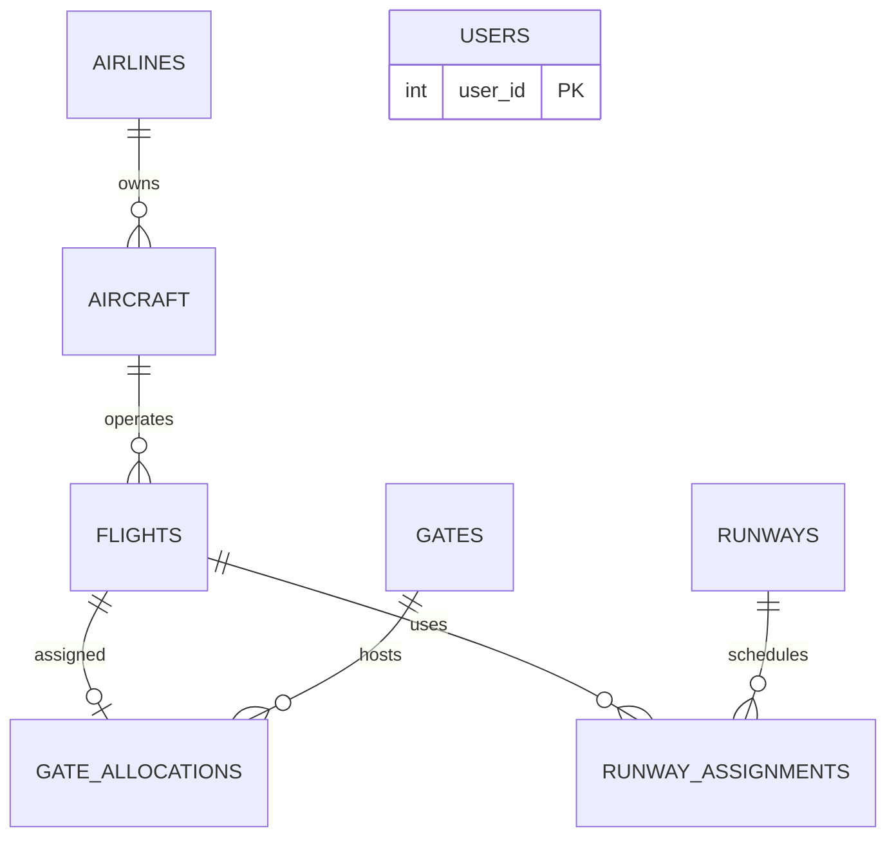

# Airport Air Traffic Control & Gate Allocation System
Java Swing GUI + JDBC + MySQL 8

## Setup
1. Run `sql/schema.sql` in MySQL Workbench (creates `atc_db` and sample data).
2. Set your MySQL password: edit `PASS` in `DBConnection.java`, or set env var `ATC_DB_PASS`.
3. Run (JDK 17+, Maven):
   `mvn compile exec:java -Dexec.mainClass=atc.Main`
   Without Maven: put `mysql-connector-j-8.x.jar` in a `lib/` folder, then
   `javac -cp "lib/*" -d out src/main/java/atc/*.java && java -cp "out:lib/*" atc.Main` (use `;` instead of `:` on Windows).

## Logins
| User | Password | Role | Tabs |
|---|---|---|---|
| admin | admin123 | ADMIN | all (can edit flights) |
| atc1 | atc123 | ATC | Dashboard, Flights (view), Runway/ATC, Reports |
| gate1 | gate123 | GATE_MANAGER | Dashboard, Flights (view), Gate Allocation, Reports |

## ER diagram (paste into https://mermaid.live)

## Where the marks are
- **Database (5):** `sql/schema.sql` - 3NF, PK/FK, UNIQUE, CHECK, ENUM, ON DELETE CASCADE, sample data.
- **GUI (5):** `*Panel.java`, `LoginFrame`, `MainFrame` - role-based tabs, GridBagLayout forms, colour-coded status, validation dialogs.
- **JDBC (5):** `DBConnection` + `*DAO` - PreparedStatement everywhere, try-with-resources, transaction with commit/rollback in `AllocationDAO`, `SELECT ... FOR UPDATE` row lock.

## Demo flow
Login (admin) > Flights: add a flight > Gate Allocation: pick it, Find Free Gates, Allocate > show new row in Workbench
(`SELECT * FROM gate_allocations;`) > try a conflicting allocation (error) > Release > Runway/ATC: assign a slot, try one within 5 min (error) > Reports.
